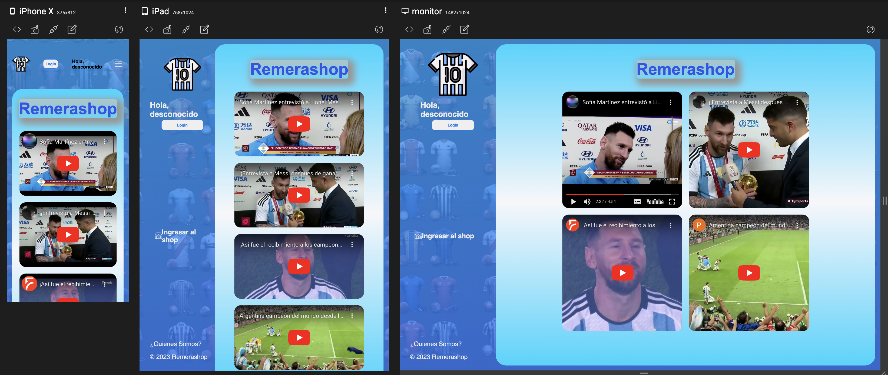
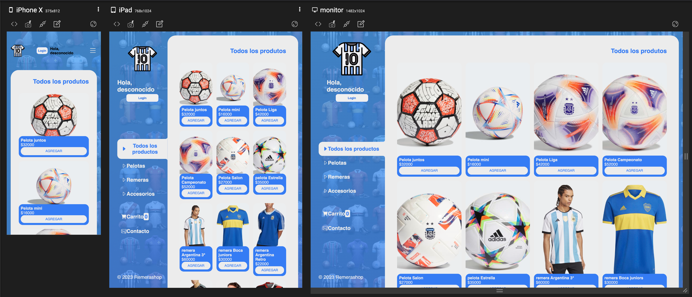
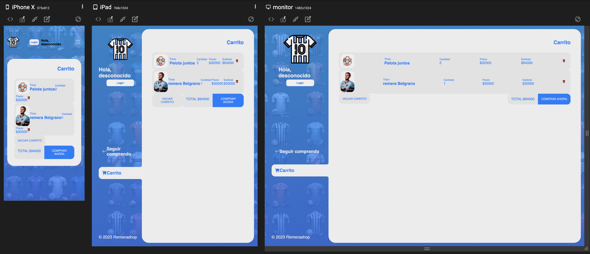
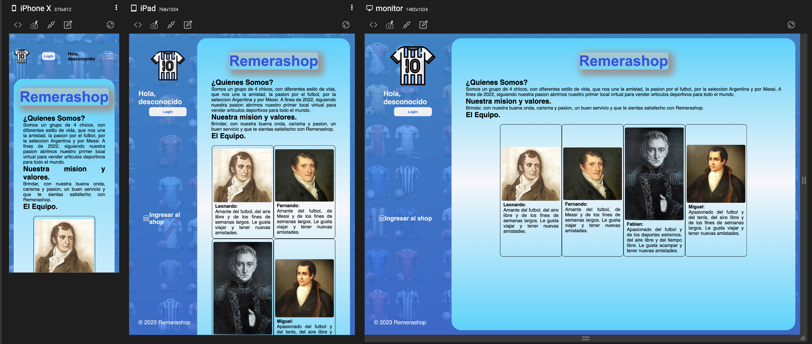
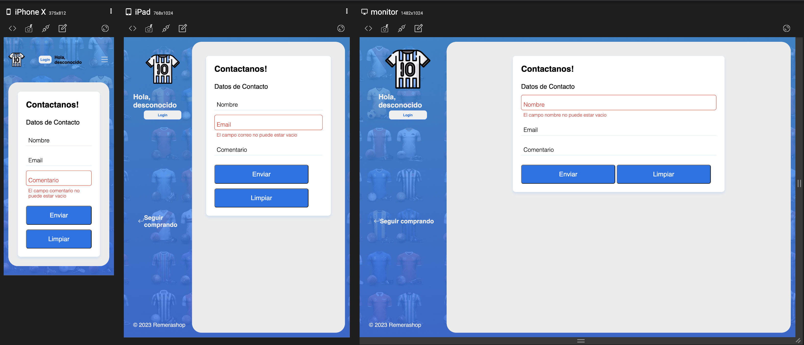
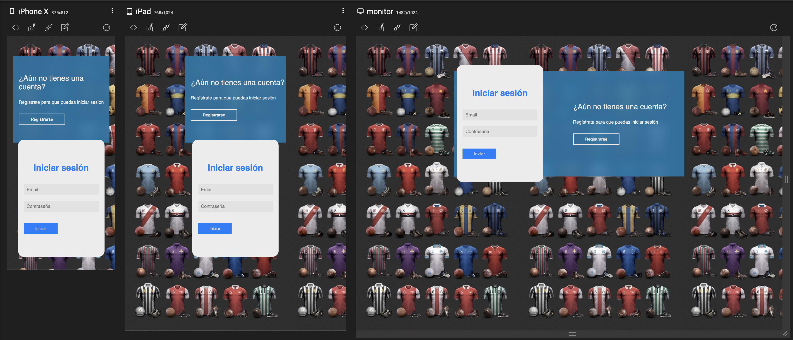

# [Remerashop]( https://ephemeral-marshmallow-b5ff48.netlify.app/index.html)
## Es un sitio web de venta de productos deportivos. 
link:
https://ephemeral-marshmallow-b5ff48.netlify.app/index.html
***
## Integrantes:
- Benavidez Fernando
- Leonardo Bortolini
- Miguel Isasmendi
- Fabián Benitez Do Santos
### **Codo a Codo, comision 23031.**
***
## realizado con :

***
## Descripcion :
### la web se compone de los siguientes html's:
El sitio propone el registro de usuarios, logueo, tienda de productos, carrito de compra y envio de consultas.
- **index.html**:
    >- Se compone de una barra de menú al costado izquierdo que permite su ingreso para la compra de productos (tienda html) y al quienes somos (quienessomos.html). 
    >- Se compone de un footer indicando el nombre de la empresa.  
    >- En el main, se carga 4 iframes (videos de Messi y la selección argentina).
    >- Presenta animaciones sobre el título de la empresa al hacer un hover y sobre la imagen de fondo con camisetas que se mueven constantemente. 
- **login.html**:
  >- este permite el ingreso de usuarios o su registración, indicando si fue realizado con éxito o no. 
  >- Se ingresa y/o valida los usuarios mediante json-api la cual volcado en googlesheets en https://sheetdb.io/api/v1/xkc58vohznlmm
  >- Presenta animaciones sobre la imagen de fondo con camisetas que se mueven constantemente. 
- **tienda.html**:
  >- muestra todos los productos o por categoría. Cada atributo de cada producto (imagen, descripción y precio) 
  >- se carga mediante la consulta del google sheet por medio de json-api del sitio https://sheetdb.io/api/v1/doa64mqfoyi5e 
  >- Al hacer click en agregar, se carga al carrito, informando que fue adicionado.
  >- Presenta sobre la imagen de fondo con camisetas que se mueven constantemente. 
- **contacto.html**:
  >- consta de un formulario que permite enviar consultas ingresando el correo y nombre (obligatorio). 
  >- Se puede limpiar su contenido.
  >- Presenta animaciones sobre la imagen de fondo con camisetas que se mueven constantemente. 
- **carrito.html**:
    >- Muestra los productos agregados desde tienda junto con el precio unitario como total. 
    >- El carrito puede ser vaciado unitariamente o totalmente o comprar lo cargado, lo cual despliega el mensaje compra realizada
    >- Presenta animaciones sobre la imagen de fondo con camisetas que se mueven constantemente. 
- **quienessomos.html**:
    >- Detalla como surgió la empresa y sus integrantes Todas las paginas html presentan iconos y su diseño se cargan con css. 
    >-Se maqueto bajo flexbox. Se presenta un diseño de fondo de pantalla de color celeste y azul. 
    >- Presenta animaciones sobre el título de la empresa al hacer un hover y sobre la imagen de fondo con camisetas que se mueven constantemente. 

***
## Screenshot de pantallas responsivas con tres puntos de corte.
#### Se tiene en cuenta el diseño responsivo de web, mediante media queries, que permite su carga para desktop, ipad y dispositivos móviles.
[**index.html**](https://ephemeral-marshmallow-b5ff48.netlify.app/)

[**tienda.html**](https://ephemeral-marshmallow-b5ff48.netlify.app/tienda.html)

[**carrito.html**](https://ephemeral-marshmallow-b5ff48.netlify.app/carrito.html)

[**quienessomos.html**](https://ephemeral-marshmallow-b5ff48.netlify.app/quienessomos.html)

[**contacto.html**](https://ephemeral-marshmallow-b5ff48.netlify.app/contacto.html)

[**login.html**](https://ephemeral-marshmallow-b5ff48.netlify.app/login.html)
